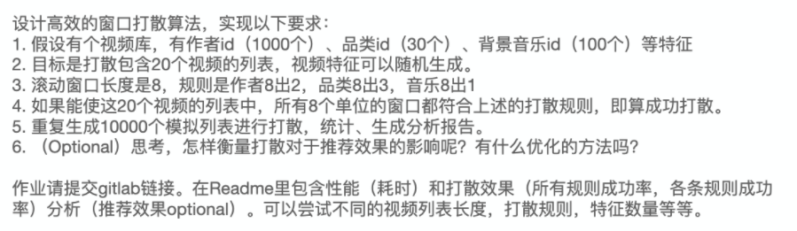

# 作业1：设计打算算法

## 随机生成
随机生成候选列表，然后检查其是否符合要求

如果必须生成10000个满足要求的列表，那么耗时1.0322秒

如果只生成10000个候选列表，那么成功率为0.3065，其中作者的规则0.9998，品类0.9921,背景音乐0.3146，总耗时0.4008秒

可以观察发现，限制成功率的最大影响即为背景音乐，因为背景音乐的要求太严格，因此可以考虑只限制背景音乐，其余采用随机的方式。
## 限制背景音乐
先对背景音乐进行限制，使滑动窗口里面的音乐都是不同的，然后对使用该音乐的视频进行随机采样，然后检查其是否符合要求

重复10000次试验，成功率为0.9845，作者规则成功率为0.9997，品类成功率为0.9848，耗时0.8766秒

可以看出只对背景音乐进行限制，取得的效果相当不错。并且，在实际情况中背景音乐与作者、品类相关度非常高，因此在对背景音乐进行限制的时候，别的限制条件的成功率应该比随机情况下的成功率更高。因此，个人认为这种方法是可行的。